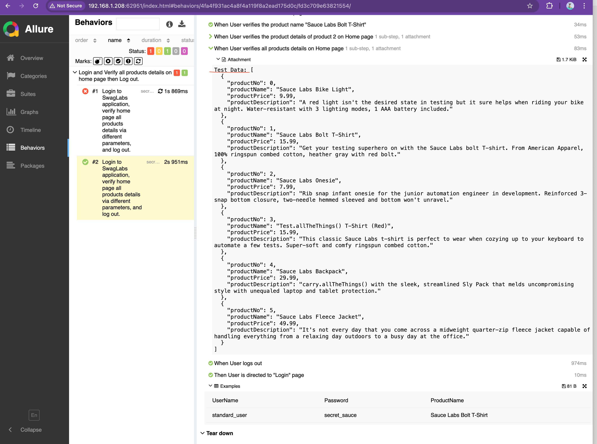

<h1> Playwright Automation Framework with CucumberJS & Allure Reporting</h1>

This repository contains an automation framework built using <strong>Playwright</strong>, <strong>JavaScript (ESM)</strong>, <strong>CucumberJS</strong>, and <strong>Allure reporting</strong> for <strong>E2E</strong> testing web applications.

This is still an ongoing project, current purpose is for skills pickup and demonstration. Play Playwright with Cucumber(BDD) using this project which is using cucumber runner now, try to cover passing test data via different ways: cucumber step argument, data table, csv file; support dynamic page creation, dynamic getLocators ...... will add more features soon, like api testing, accessibility testing... will also try to use playright runner using playwright.config.js to compare later....

<h2> Prerequisites </h2>

Ensure that you have the following installed:

    
 Node.js (version >=14) 

    
 npm is recommended 

<h2> Setup </h2>
<h3> 1. Clone the Repository and Install Dependencies </h3>
Run the following command to install all the required dependencies:
    npm install

<h3> 2. Configuration </h3>
Cucumber Configuration (cucumber.mjs): This file contains configurations specific to Cucumber, such as the location of feature files and the step definition files.

<h3> 3. Configure Allure Reporting</h3>
To generate Allure reports after the tests run, make sure you have Allure installed globally or you can install it via npm install -g allure-commandline.

<h3> 4. Running Tests</h3>
You can run your tests using the following command:
    npm run test
This will:
    Run the tests using CucumberJS.
    Generate the Allure report results inside the allure-results/ directory.

<h3> 5. Viewing the Allure Report </h3>
After running the tests, you can generate and view the Allure report by running the following command:
    npm run report
This will open a web server and display the Allure report in your browser.

<h2> Screenshots </h2>

### [Passed Allure Result](screenshots/allure_1.png)

### [Failed Allure Result](screenshots/allure_2.png)

